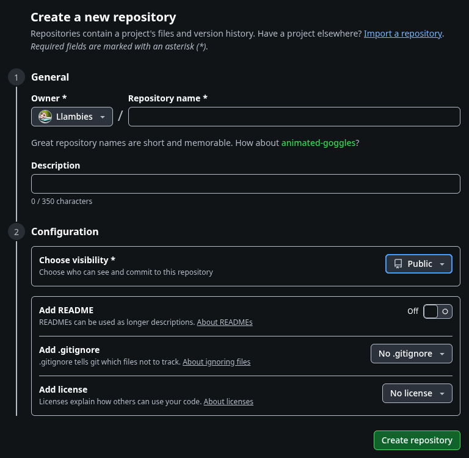
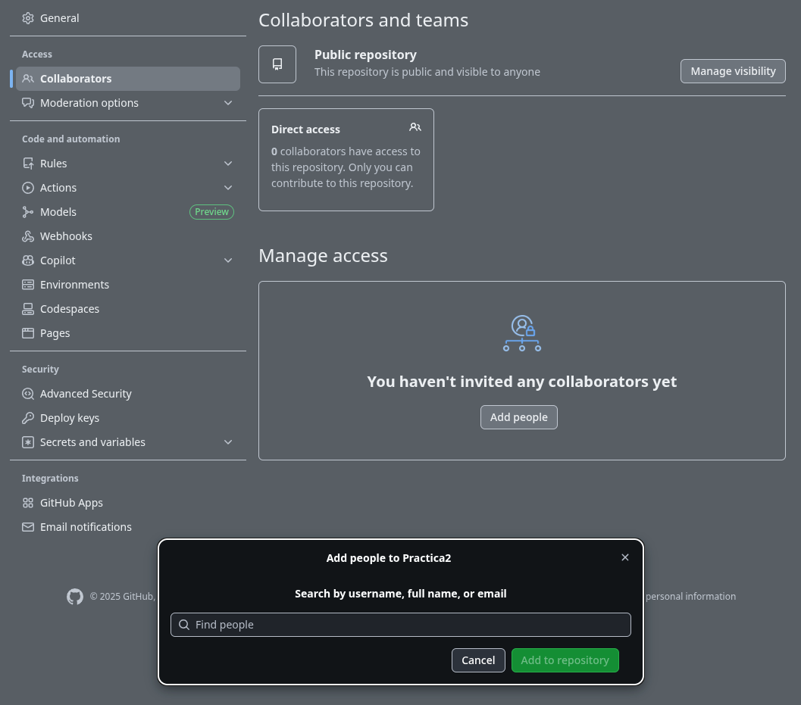
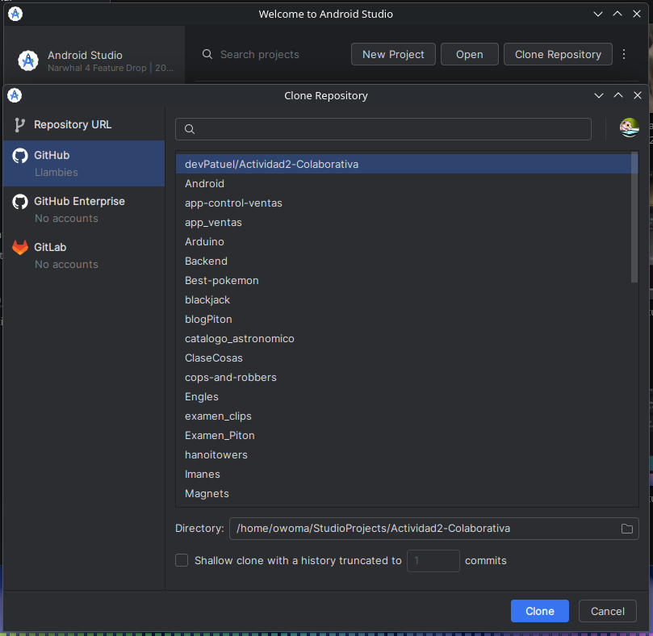
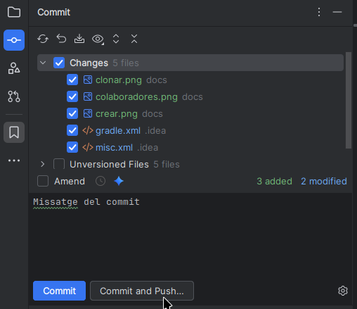
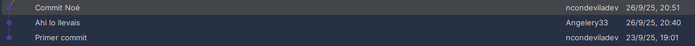
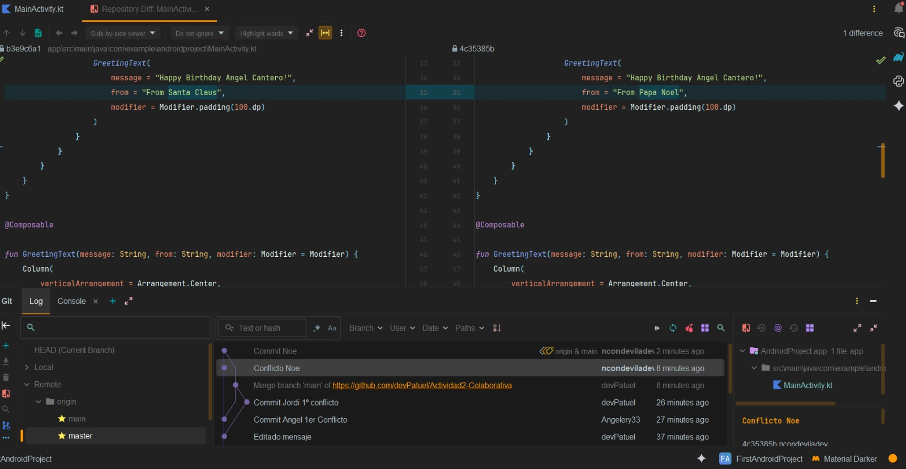
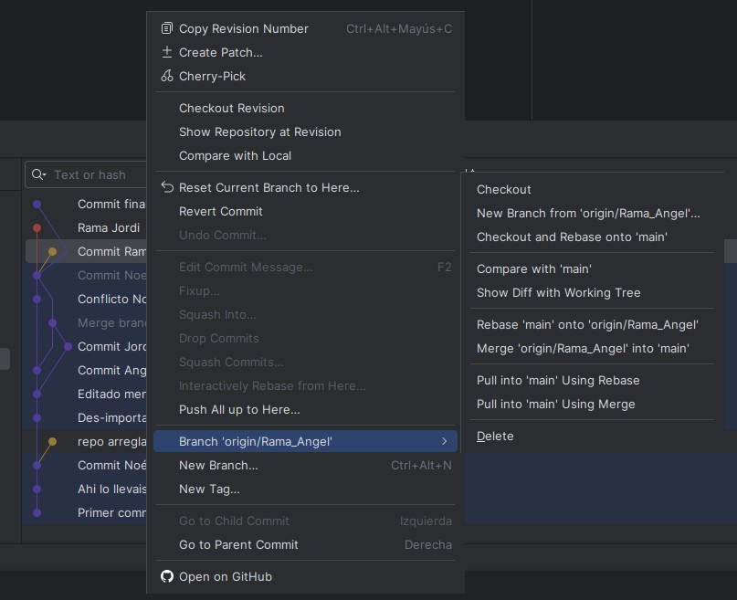
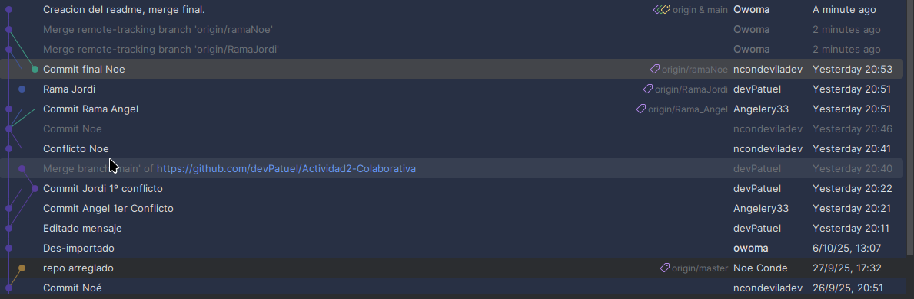

# Pràctica 2 - Github
Noe, Angel, Jordi y Adrian
## Exercici 1
### 1 - Crear un repositori de Github i afegir la resta de col·laboradors.
Creem un projecte a Github

Agregem els colaboradors

### 2 - Alumne 1: crea un projecte d’Android i fa push al repositori remot.
Jordi: obre Android Studio → New Project → Empty Activity.
Desa el projecte en una carpeta local i executa:
``` shell
git init
git remote add origin https://github.com/devPatuel/Actividad2-Colaborativa
git add .
git commit -m "Primer commit"
git push -u origin main
```
###  3 - Resta d’alumnes: clonen el projecte.
Dins la carpeta un volen clonar poden fer:
``` shell
git clone https://github.com/usuari/nom-repositori.git
```
O desde android studio:

### 4 - Un alumne modifica el projecte i fa push al repositori remot.
``` shell
git add .
git commit -m "Missatge"
git push
```
Dins d'android studio:

### 5 - La resta d’alumnes fan pull, canvis i push, en ordre

### 6 - Tots fan pull canvis i push al mateix temps: resoldre els conflictes.

### 7
### 8 - Un alumne mescla les branques en ordre en la branca main: resolució de conflictes.
Anem una a una cada rama y en el menu contextual:

Una vegada fets tots els merge, fem un commit amb tots els cambis
